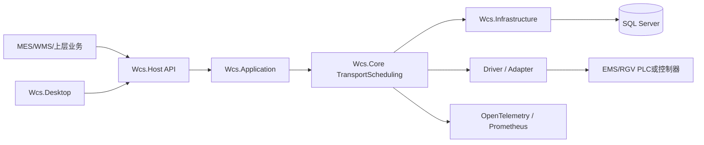

# EMS/RGV 统一调度总体设计说明书

## 1. 设计目标

本系统在 WCS Runtime Engine 中提供 EMS 和 RGV 的统一业务调度能力。统一的是车辆、任务、路径、路权、执行、命令、回执、恢复和监控模型；设备厂商协议、PLC 标签和运动控制保留在 Driver/Adapter 层。

## 2. 总体原则

1. 调度与执行分离。
2. 先预留资源，后下发命令。
3. 请求、任务和命令均具备幂等标识。
4. 位置只使用可信反馈，不以时间推算替代真实状态。
5. 数据库、内存、PLC 三方不一致时优先停止自动续跑。
6. 物理占用优先于软件租约和逻辑状态。
7. 危险操作必须经过权限与独立审批。
8. 监控、备份和仿真不得阻塞控制闭环。
9. 现场配置不得硬编码进通用业务逻辑。
10. 生产控制层不使用生成式 AI。

## 3. 系统上下文



## 4. 分层设计

### 4.1 Wcs.Host

职责：

- 提供 HTTP API；
- 绑定认证身份；
- 暴露 Health、Prometheus 和诊断报告；
- 承载 TraceId 中间件；
- 不实现核心调度算法。

### 4.2 Wcs.Application

职责：

- 注册核心服务和后台任务；
- 管理启动恢复顺序；
- 周期执行驱动同步、生产派单、趋势、健康、一致性、备份等任务；
- 确保单个后台任务异常不终止 Host。

### 4.3 Wcs.Core

职责：

- 统一模型；
- 派单和车辆选择；
- 路径和路权；
- 执行状态机；
- PLC 驱动抽象；
- 交通控制；
- 生产调度；
- 配置治理；
- 联调、恢复、可观测性、备份和仿真。

### 4.4 Wcs.Infrastructure

职责：

- SQL Server 持久化；
- 文件逻辑备份；
- 配置绑定；
- 数据库初始化；
- 用生产实现替换 Core 的内存存储。

### 4.5 Wcs.Desktop

职责：

- 提供调度、交通、生产、配置、诊断、联调、可观测性、韧性和仿真界面；
- 高风险功能不在界面中直接绕过审批；
- 对外仅通过 Host API 访问系统。

## 5. 核心组件

| 组件 | 主要职责 |
|---|---|
| `TransportVehicleRegistry` | 车辆快照、版本保护、状态 CAS |
| `TransportVehicleSelector` | 候选车辆过滤和排序 |
| `TransportRouteCenter` | 统一拓扑路径计算 |
| `RouteReservationManager` | 路段原子预留和租约 |
| `TransportTrafficCoordinator` | 闭塞、路口、等待图和物理占用 |
| `UnifiedTransportDispatchEngine` | 幂等派单、路径、预留和车辆占用 |
| `TransportExecutionEngine` | 运输任务执行状态机 |
| `TransportCommandDispatcher` | 统一命令下发和结果持久化 |
| `ReliableTransportVehicleDriver` | 心跳、序号相关、超时和回执 |
| `TransportRecoveryCoordinator` | 启动恢复和三方对账 |
| `TransportProductionDispatchService` | 生产队列和动态优先级 |
| `TransportOperationGovernanceService` | 权限、审批、审计和一次性执行 |
| `TransportCommissioningService` | 点位联调和受控单点读写 |
| `TransportObservabilityService` | Trace、Metrics、健康和一致性 |
| `TransportResilienceService` | 生产就绪、备份和恢复演练 |
| `TransportSimulationService` | 历史回放、A/B、容量和验收仿真 |

## 6. 主要运行链路

### 6.1 生产派单

```text
运输请求入队
→ 计算动态优先级
→ 检查站点容量
→ 选择候选车辆
→ 计算空驶/载货路径
→ 单轨与交通准入
→ 原子预留路权
→ 占用车辆
→ 创建执行任务
→ 启动执行
```

### 6.2 命令执行

```text
执行状态机生成逻辑命令
→ 命令泵按车辆分发
→ Driver 写入命令载荷和请求位
→ PLC 接收并返回确认序号
→ Driver 校验相关性
→ 执行状态机消费完成反馈
```

### 6.3 启动恢复

```text
加载配置与点位
→ 恢复车辆/任务/路权/命令
→ 读取 PLC 诊断状态
→ 三方一致性巡检
→ 生成恢复冲突
→ 可确认项恢复
→ 不可确认项暂停并人工处置
```

## 7. 状态单一事实源

| 状态 | 运行时权威 | 持久化用途 | PLC 用途 |
|---|---|---|---|
| 车辆业务状态 | `TransportVehicleRegistry` | 重启恢复、审计 | 反馈在线、位置和运行状态 |
| 活动任务 | `TransportExecutionEngine` | 检查点和恢复 | 当前任务/命令对账 |
| 路权 | `TransportTrafficCoordinator` | 重启恢复 | 物理占用确认 |
| 命令 | `TransportCommandDispatcher` | 幂等和补偿 | 接收/确认/完成 |
| 生产队列 | `TransportProductionDispatchService` | 重启恢复 | 不直接写 PLC |

SQL 不在运行过程中直接替代内存调度状态；PLC 反馈也不允许绕过版本和状态机直接覆盖业务状态。

## 8. 部署形态

### 8.1 当前生产基线

- 单调度实例；
- SQL Server 持久化；
- EMS/RGV 每车单写通道；
- Desktop 和 MES/WMS 通过 Host API 访问；
- Prometheus/OTLP 可选；
- 本地离线逻辑备份。

### 8.2 双机约束

若使用两台服务器，必须采用 Active/Standby 单活方式，并在主节点选举、Fence Token、租约、命令幂等和接管对账完成前禁止双写 PLC。

## 9. 安全边界

1. `OccupancyConfirmed` 未清除时禁止释放路权和单轨许可。
2. 运动命令失败默认不自动重试。
3. `Stop` 补偿必须受治理审批。
4. 配置回滚必须先创建安全快照。
5. 备份恢复只导入配置快照，不自动写回活动任务、车辆位置和命令。
6. 仿真运行在隔离模型中，不调用生产派单和 PLC 接口。

## 10. 可观测性

- ActivitySource：`Wcs.Transport`
- Meter：`Wcs.Transport`
- HTTP 响应头：`X-Trace-Id`
- Prometheus：`/metrics`
- 就绪探针：`/health/ready`
- 存活探针：`/health/live`

## 11. 数据持久化策略

结构化运行状态使用专用 SQL 表；策略、趋势、决策、健康、备份清单、仿真和验收结果使用 `Wcs_TransportJournal` 分类记录。

## 12. 质量保证

- Core 自动化测试覆盖调度、交通、执行、驱动、恢复、治理、联调、生产、可观测性、韧性和仿真；
- Host 与 Desktop 在 Windows CI Release 模式构建；
- 阶段设计和测试文档与代码同仓库版本管理；
- 任何控制层变更必须补充安全回归测试。
