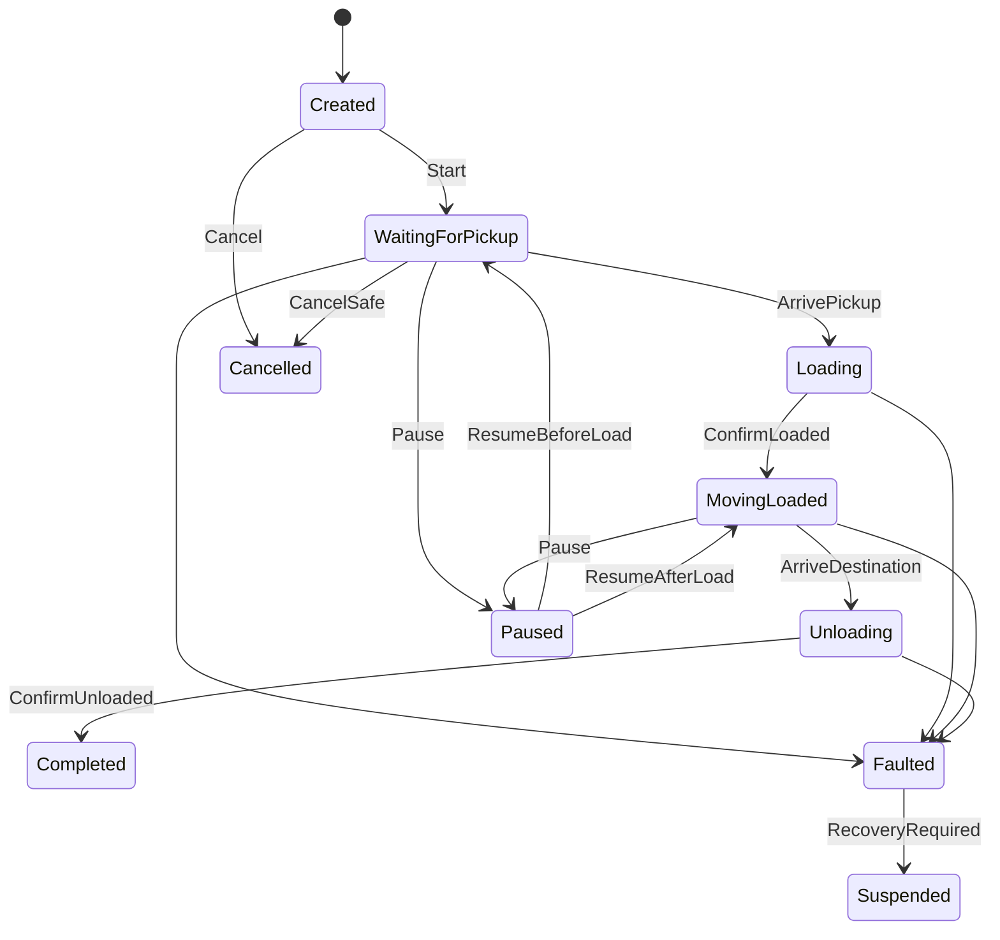
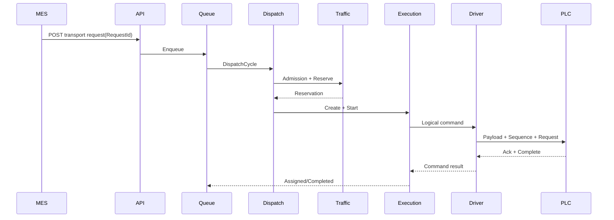
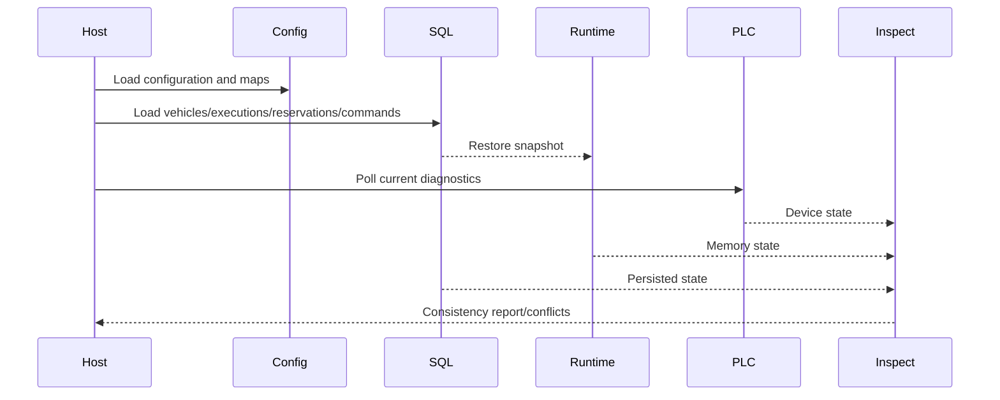

# EMS/RGV 状态机与业务数据流说明书

## 1. 目的

本文统一说明车辆、运输执行、生产队列、PLC 命令、报警、治理和恢复状态机，明确允许的状态迁移、触发条件和禁止操作。

## 2. 车辆状态机

```text
Offline → Idle
Idle → Executing
Executing → Idle
Idle → Charging
Charging → Idle
任意运行态 → Faulted
Faulted → Maintenance
Faulted → Idle（需确认）
Maintenance → Idle
Maintenance → Offline
```

### 2.1 Offline → Idle

必须满足：

- 驱动连接成功；
- 心跳有效；
- 可信节点有效；
- 无未确认活动命令；
- 无恢复冲突。

### 2.2 Idle → Executing

必须满足：

- 车辆在线；
- 能力和类型匹配；
- 电量满足；
- 路径存在；
- 交通准入通过；
- 路权预留成功；
- CAS 占用成功。

### 2.3 Faulted → Idle

不得仅由报警恢复自动触发。必须确认 PLC、车辆位置、货物状态、活动任务和物理占用。

## 3. 执行任务状态机



### 3.1 Completed

完成时：

- 执行进入终态；
- 车辆恢复 Idle；
- 释放无物理占用的路权；
- 清理生产队列终态；
- 记录 Journal 和性能指标。

### 3.2 Cancelled

取消不等同于立即释放所有资源。若存在物理占用，资源继续保留直到反馈确认。

### 3.3 Suspended

用于启动恢复或故障后无法确认状态的任务。Suspended 任务不得自动下发新的运动命令。

## 4. 生产队列状态机

```text
Queued
→ Dispatching
→ Assigned

Dispatching → WaitingForStation
Dispatching → WaitingForTraffic
Dispatching → WaitingForVehicle
Dispatching → Failed

Queued/Waiting* → Cancelled
```

说明：

- `Queued`：等待竞争；
- `Dispatching`：当前周期正在尝试；
- `WaitingForStation`：目标站点满载或排队超限；
- `WaitingForTraffic`：单轨或交通资源暂不可用；
- `WaitingForVehicle`：无符合条件车辆；
- `Assigned`：车辆、路权和执行启动均成功；
- `Failed`：不可恢复的初始化失败；
- `Cancelled`：业务取消。

## 5. PLC 命令状态机

```text
Pending
→ Sent
→ Acknowledged
→ Completed

Sent/Acknowledged → TimedOut
Pending/Sent/Acknowledged → Failed
```

### 5.1 Pending

逻辑命令已产生但尚未交给 Driver。

### 5.2 Sent

载荷、命令序号和请求位已经写入 PLC。

### 5.3 Acknowledged

PLC 返回与当前命令一致的确认序号和接收状态。

### 5.4 Completed

PLC 返回完成状态，执行状态机可继续迁移。

### 5.5 TimedOut/Failed

- Stop 可进入审批补偿；
- Move、Load、Unload 默认不自动重试；
- 重启后不得因为状态为 Sent 自动重发。

## 6. 报警状态机

```text
Active
→ Acknowledged
→ PendingRecover
→ Recovered
```

报警恢复只表示报警条件消失，不自动改变车辆故障、任务暂停或物理占用状态。

## 7. 治理操作状态机

```text
Requested
→ Approved
→ Executing
→ Completed

Requested → Rejected
Approved → Expired（可选）
Executing → Failed
```

约束：

- 申请人与审批人不同；
- 目标 ID 必须一致；
- OperationId 不可重复执行；
- 执行失败后不得直接复用旧审批进行不同目标操作。

## 8. 恢复冲突状态

三方对账结果：

```text
Consistent
RuntimeWinsCandidate
DeviceWinsCandidate
ManualConfirmationRequired
Resolved
```

系统默认不自动选择数据库或 PLC 获胜。只有满足明确规则的低风险字段可生成候选，其余进入人工确认。

## 9. 主业务数据流

### 9.1 上层任务到 PLC



### 9.2 PLC 状态到运行时

```text
PLC 批量读取
→ 点位映射解析
→ Driver Diagnostic
→ Vehicle Snapshot
→ Registry 版本更新
→ Execution PositionFeedback
→ 路权滚动释放/扩展
→ Metrics/Trace/Alarm
```

## 10. 启动恢复数据流



## 11. 状态变更事件

重要状态变更应产生可追踪记录：

- 派单成功/失败；
- 任务开始、暂停、恢复、完成、故障、取消；
- 路权获得、等待、释放、物理占用；
- PLC 命令发送、确认、完成、超时；
- 车辆上线、离线、故障；
- 配置变更、审批、回滚；
- 一致性差异、恢复冲突；
- 备份、演练、仿真和验收。

## 12. 禁止的跨状态操作

1. Offline/Faulted 车辆直接进入 Executing。
2. 未获得路权即下发 Move。
3. 未 ConfirmLoaded 即进入载货移动。
4. 未 ConfirmUnloaded 即完成任务。
5. 物理占用未清除即释放单轨方向。
6. TimedOut 的运动命令自动重发。
7. Suspended 任务自动恢复执行。
8. 报警恢复直接将车辆设为 Idle。
9. 仿真结果直接更新生产参数。
