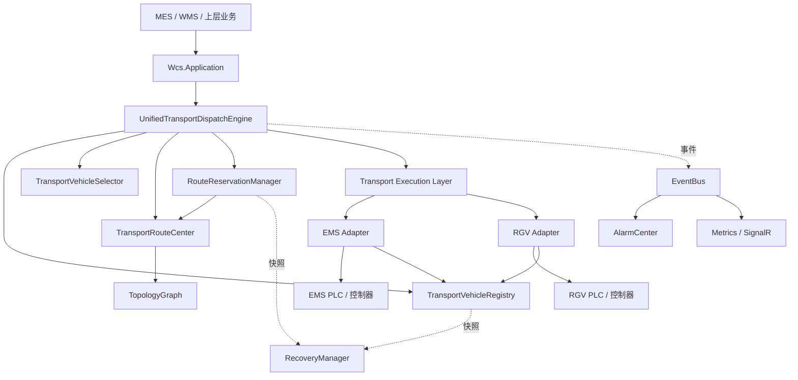
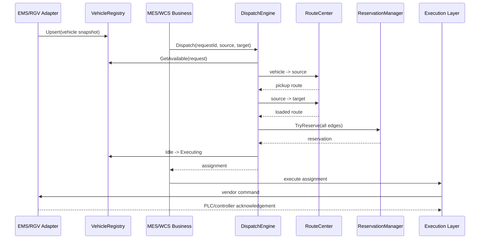

# EMS / RGV 统一调度总体架构

## 1. 文档目标

本文定义 WCS Runtime Engine 中 EMS 空中台车与 RGV 地面车辆的统一调度边界、核心模型、运行数据流、故障恢复策略及阶段演进路线。

统一调度的目标不是把 EMS 和 RGV 的底层控制协议强行做成相同，而是把二者在 WCS 层抽象为统一的“运输车辆、运输任务、路径、路段预留和执行回执”。厂商协议、PLC 地址和运动控制差异留在 Adapter/Driver 层。

## 2. 设计原则

1. **统一调度、分离执行**：调度引擎不直接读写 PLC，只输出车辆、路径和预留结果。
2. **状态单一事实源**：车辆状态、活动任务、路段预留在运行时只能有一个权威来源。
3. **先预留、后下发**：路径资源全部预留成功后，车辆才能进入执行状态。
4. **请求幂等**：相同 `RequestId` 重复请求必须返回同一分配，不得重复派车。
5. **拓扑复用**：复用现有 `TopologyGraph` 与 `TransportRouteCenter`，避免 EMS/RGV 各自维护一套路网。
6. **协议隔离**：EMS、RGV、AGV 后续都通过 Adapter 转换为统一快照和命令回执。
7. **可恢复优先**：第一阶段先保证单实例确定性，后续将活动状态接入快照与事件回放。

## 3. 总体分层



## 4. 核心模块

### 4.1 TransportVehicleRegistry

职责：

- 保存 EMS/RGV 统一车辆快照。
- 根据版本号和更新时间拒绝旧状态覆盖新状态。
- 过滤在线、空闲、车辆类型和能力满足要求的候选车辆。
- 通过 CAS 状态迁移避免同一车辆被并发重复占用。

统一车辆快照包含：

- `VehicleId`
- `Kind`：EMS / RGV
- `State`：Offline / Idle / Executing / Charging / Faulted / Maintenance
- `CurrentNodeId`
- `IsOnline`
- `BatteryPercent`
- `ActiveTaskCount`
- `Capabilities`
- `Version`
- `UpdatedAtUtc`

### 4.2 TransportVehicleSelector

职责：对符合基本条件的车辆进行排序，不负责最终占用。

第一阶段评分：

```text
Score = 空驶路径权重 × 100
      + 当前任务数 × 1000
      + (100 - 电量百分比)
```

分数越低优先级越高。后续可扩展车辆方向与掉头成本、充电阈值、区域归属、维护状态、载重与夹具能力、任务等待时间和紧急等级。

### 4.3 TransportRouteCenter

复用现有模块，负责：

- 从当前位置到取货点的空驶路径。
- 从取货点到目标点的载货路径。
- 故障节点、故障边绕行。
- 最短、最空闲、平衡策略。
- 路段拥塞统计。

`TransportVehicleCapability` 表示车辆能力；`EdgeCapability` 表示路径能力。两者必须分离，避免把“车辆能否搬运”和“路段是否允许通行”混为一谈。

### 4.4 RouteReservationManager

职责：

- 对一次任务涉及的全部路段执行原子预留。
- 任一路段已被占用，则本次预留全部失败。
- 通过 TTL/Lease 自动清理超时预留。
- 完成、取消或失败时释放路径。

第一阶段为进程内实现；生产阶段需要持久化活动预留、所属任务、创建时间、到期时间、恢复状态和最后一次车辆/PLC 确认时间。

### 4.5 UnifiedTransportDispatchEngine

调度引擎执行顺序：

1. 校验请求。
2. 按 `RequestId` 检查幂等结果。
3. 获取可用车辆。
4. 计算候选车辆到取货点的路径并排序。
5. 计算取货点到目标点的载货路径。
6. 原子预留空驶和载货路径涉及的全部路段。
7. 将车辆从 `Idle` 原子切换到 `Executing`。
8. 保存不可变派单结果。
9. 返回车辆、路径和预留编号。

任务完成时删除活动分配、释放路径预留，并将车辆恢复为 `Idle`。

## 5. 统一数据流



## 6. 状态与一致性

### 6.1 车辆状态机

```text
Offline -> Idle
Idle -> Executing
Executing -> Idle
Idle -> Charging
Charging -> Idle
任意运行态 -> Faulted
Faulted -> Maintenance / Idle
Maintenance -> Idle / Offline
```

任何车辆进入 `Executing` 前必须在线、处于 `Idle`、位置有效、能力满足任务、路径存在且路段预留成功。

### 6.2 PLC 无连续位置反馈的处理

如果 PLC 只提供到站信号、不提供连续坐标，WCS 位置必须按“可信节点”维护：

- 出发前位置：最后确认节点。
- 运行中位置：`LastConfirmedNode + ReservedSegment`。
- 到站后位置：由到位信号、读码器、RFID、编码器或 EMS 控制器回执确认。
- 通信中断时禁止根据时间推算并直接覆盖真实位置。

单路线现场仍应建立节点与闭塞区段模型。路线简单并不代表可以省略预留；闭塞控制决定能否安全追车、会车和恢复。

## 7. 持久化与恢复

第一阶段状态位于内存，生产阶段应纳入：

- `TransportVehicleRuntime`
- `TransportDispatchAssignmentRuntime`
- `RouteReservationRuntime`
- `TransportCommandRuntime`
- `TransportExecutionCheckpoint`

恢复流程：

1. 加载最近快照。
2. 恢复车辆、分配和路段预留。
3. 从事件存储重放快照后的状态变化。
4. 向 PLC/控制器读取当前位置、任务号和执行状态。
5. 对数据库、内存与 PLC 三方状态执行对账。
6. 无法确认的任务进入 `Suspended`，禁止自动重复下发。

## 8. 与现有 WCS 模块的关系

| 现有模块 | 统一调度中的作用 |
|---|---|
| `TopologyGraph` | 统一节点和有向边模型 |
| `TransportRouteCenter` | 路径、故障绕行和拥塞 |
| `ObjectTrackingCenter` | 物料当前位置与目标位置 |
| `ResourceLockManager` | 设备、工位等非路段资源锁 |
| `TaskEngine` | 上层任务编排与生命周期 |
| `EventBus` | 派单、执行、完成、故障事件 |
| `AlarmCenter` | 通信、超时、冲突和死锁报警 |
| `RecoveryManager` | 快照恢复与启动对账 |
| `CommandCenter` | 后续统一命令下发入口 |

路段预留管理连续路径上的互斥与 TTL；`ResourceLockManager` 管理工位、设备、升降机、移载口等离散资源，两者职责不同。

## 9. 部署约束

第一阶段默认单调度实例。若部署双机或多实例，必须先解决调度主节点选举、分布式路段锁、同一车辆单写通道、活动任务共享状态及 PLC 命令幂等和回执去重。

在这些能力完成前，不允许两个 WCS 实例同时向同一 EMS/RGV 控制器下发任务。

## 10. 演进路线

### 第一阶段：统一调度内核

- 统一车辆模型。
- 车辆注册表。
- 候选车辆排序。
- 双段路径规划。
- 原子路段预留。
- 请求幂等。
- 单元测试与文档。

### 第二阶段：执行适配层

- `IEmsVehicleAdapter`
- `IRgvVehicleAdapter`
- 命令、回执和超时。
- PLC 任务号幂等。
- 执行状态机。

### 第三阶段：交通控制

- 闭塞区段方向锁。
- 路口冲突矩阵。
- 会车、追车与优先级让行。
- 死锁检测与回退点。
- 区域级并行调度。

### 第四阶段：持久化与高可用

- 运行时快照。
- 事件回放。
- 启动三方对账。
- 主备切换。
- 分布式锁或单主调度。

### 第五阶段：优化调度

- 任务批量优化。
- 能耗与充电策略。
- 拥堵预测。
- 仿真验证。
- KPI 与可视化。
